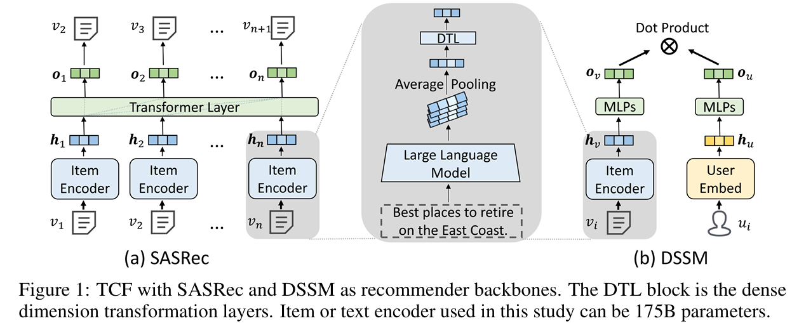

# Text-based Collaborative Filtering
<a href="https://arxiv.org/pdf/2305.11700.pdf" alt="arXiv"></a>
<!-- <a href="https://dl.acm.org/doi/abs/10.1145/3539618.3591932" alt="CIKM"></a>  -->
 
 
 

Quick links: 
[🗃️Dataset](#Dataset) |
[📭Citation](#Citation) |
[🛠️Reproduce](#Training) |


This repository contains the source code for the **CIKM 2025** paper **''Exploring the upper limits of text-based collaborative filtering using large language models: Discoveries and insights''**.

 


Full version in [[Arxiv]](https://arxiv.org/pdf/2305.11700.pdf).

## Dataset

### Data Download 

We have preprocessed the news recommendation dataset (MIND) and text-only dataset (HM, Bili) for the ease of use.

You can download preprocessed datasets from [here](https://drive.google.com/file/d/1L_eUk1ePZY-wylcK6nI0ljZdyImYDFkB/view). Unzip the downloaded file, and put the unzipped directory `data` into the root directory of this repository.

The datasets are organized as follows:

```
data/
├── bl_50k/ # Random selected 50,000 users' interactions from Bili dataset
├── bl_50k_20/ # Selected Bili dataset with items < 20 interactions removed
├── bl_50k_50/ # Selected Bili dataset with items < 50 interactions removed
├── bl_50k_200/ # Selected Bili dataset with items < 200 interactions removed
├── hm_200k/ # Random selected 200,000 users' interactions from HM dataset
├── hm_200k_20/ # Selected HM dataset with items < 20 interactions removed
├── hm_200k_50/ # Selected HM dataset with items < 50 interactions removed
├── hm_200k_200/ # Selected HM dataset with items < 200 interactions removed
├── mind_200k/ # Random selected 200,000 users' interactions from MIND dataset
├── mind_200k_20/ # Selected MIND dataset with items < 20 interactions removed
├── mind_200k_50/ # Selected MIND dataset with items < 50 interactions removed
├── mind_200k_200/ # Selected MIND dataset with items < 200 interactions removed
```

## Training

### Requirements
```
# Create a conda environment
conda create -n tcf python=3.8
conda activate tcf

# Install requirements
pip install -r requirements.txt
 
# Install PyTorch 1.12.1+cu113
wget https://download.pytorch.org/whl/cu113/torch-1.12.1%2Bcu113-cp38-cp38-linux_x86_64.whl
pip install torch-1.12.1%2Bcu113-cp38-cp38-linux_x86_64.whl
rm torch-1.12.1%2Bcu113-cp38-cp38-linux_x86_64.whl
```

### Pre-inference item embeddings 

For training efficiency and to stay within CUDA memory for models up to 175B, we precompute item embeddings with chunked, block‑wise inference. This stores intermediate block‑level latent embeddings, trading more time and disk space for much lower peak memory than loading the full model with transformers' `device_map=auto`.

The chunked, block‑wise inference currently only supports the following models:
- opt series
- flan-t5 series
- bert/roberta series

Example: `facebook/opt-125m` on `bl_50k`. To use another model or dataset, adjust the arguments in `pre_inference/run.py`.
To run the pre‑inference script:

```
cd pre_inference
python run.py \
    --accelerator gpu \
    --min_item_seq_len 5 \
    --max_item_seq_len "None" \
    --sasrec_seq_len 20 \
    --tokenized_len 20 \
    --dataset bl_50k \ 
    --plm_name facebook/opt-125m \ 
    --plm_last_n_unfreeze 0 \
    --pre_inference_batch_size 1 \
    --pre_inference_devices 0 \
    --pre_inference_precision 32 \
    --pre_inference_num_workers 4 \
    --pre_inference_layer_wise False
```

About `--plm_last_n_unfreeze`:

- Set it to N to unfreeze the last N layers during training; inference saves latents right before those N layers. If 0, all layers are frozen and embeddings are the final‑layer outputs.

- For very large models that cannot be loaded with `device_map`, choose N based on the model's layer count (see the model card) and your GPU memory. Example: `facebook/opt-175b` has 96 layers. Start with `--plm_last_n_unfreeze 90`: the first run computes up to the embedding layer plus the first 6 blocks and stores the intermediate latents. Then rerun with `80`; the script loads the saved latents and processes the next 10 blocks. Iterate by decreasing N (80, 70, 60, 50, 40, 30, 20, 2, 0) to complete inference.

The inferenced item embeddings will be saved as `data/{dataset}/{dataset}_maxlen@{max_item_seq_len}_minlen@{min_item_seq_len}_toklen@{tokenized_len}_saslen@{sasrec_seq_len}_processed/{model_name}_freeze@{n_total_layers-plm_last_n_unfreeze}_inferenced_embs.pt`

### Training

#### For id-based CF training, you can use the following command

Take `bl_50k` as an example:

```
cd train
python -m torch.distributed.launch --nproc_per_node 1 --master_port 1251 run.py \
    --root_data_dir "../data/" \
    --dataset "bl_50k" \
    --behaviors "behaviors.tsv" \
    --news "videos.tsv" \
    --mode "train" \
    --item_tower "id" \
    --loss_type "IBCE" \
    --split_method "leave_one_out" \
    --epoch 50 \
    --l2_weight 0.1 \
    --drop_rate 0.1 \
    --batch_size 64 \
    --lr 1e-3 \
    --embedding_dim 64 \
    --label_screen "YOUR_EXPERIMENT_NAME" \
    --power 1 \
    --architecture "DSSM" \
    --early_stop_patience 10 \
    --n_project_out_mlp_layers 1 \
    --n_mlp_layers 0
```

#### For text-based CF training, you can use the following command

Take SASRec for `bl_50k` and `facebook/opt-125m` with unfreeze last 2 layers as an example:

```
cd train
python -m torch.distributed.launch --nproc_per_node 1 --master_port 1251 run.py \
    --root_data_dir "../data/" \
    --dataset "bl_50k" \
    --behaviors "behaviors.tsv" \
    --news "videos.tsv" \
    --mode "train" \
    --language_model_name "facebook/opt-125m" \
    --inference_path "../data/bl_50k/bl_50k_maxlen@INF_minlen@5_toklen@30_saslen@20_processed/OPT125M_freeze@10_inferenced_embs.pt" \ # change to the path of your pre-inferenced item embeddings
    --unfreeze_last_n_layer 2 \ # Should be exact same with pre-inference embeddings' unfreeze layer number
    --keep_embedding_layer "True" \ # Whether to keep the embedding layer of the PLM
    --item_tower "modal" \
    --loss_type "IBCE" \
    --split_method "leave_one_out" \
    --epoch 200 \
    --l2_weight 0.1 \
    --fine_tune_l2_weight 0.01 \
    --drop_rate 0.1 \
    --batch_size 64 \
    --lr 1e-3 \
    --fine_tune_lr 5e-5 \
    --embedding_dim 512 \
    --label_screen "YOUR_EXPERIMENT_NAME" \
    --power 1 \
    --architecture "SASRec" \ # DSSM or SASRec
    --transformer_block 2 \ # SASRec's transformer block number
    --num_attention_heads 2 \ # SASRec's attention heads number
    --early_stop_patience 5 \
    --n_project_out_mlp_layers 2 \
    --n_mlp_layers 0 \
```

## Citation
If you use our code or find TCF useful in your work, please cite our paper as:

```bib
@article{li2023exploring,
  title={Exploring the upper limits of text-based collaborative filtering using large language models: Discoveries and insights},
  author={Li, Ruyu and Deng, Wenhao and Cheng, Yu and Yuan, Zheng and Zhang, Jiaqi and Yuan, Fajie},
  journal={arXiv preprint arXiv:2305.11700},
  year={2023}
}
```

## Additional Results

**Table 1: Accuracy (NDCG@10) comparison of IDCF and TCF using DSSM and SASRec. _FR_ represents using frozen LM, while _FT_  represents using fine-tuned LM.**


**Table 2: Warm item recommendation (NDCG@10). 20 means items < 20 interactions are removed. TCF\textsubscript{175B} uses the pre-extracted features from the 175B LM. Only SASRec backbone is reported.**


**Table 3: TCF's results (NDCG@10)  with renowned text encoders in the last 10 years. Text encoders are frozen and the SASRec backbone is used. Notable  advances in NLP benefit RS.**


**Figure 1: TCF’s performance (y-axis: NDCG@10(%)) with 9 text encoders of increasing size (x-axis). SASRec (upper three subfigures) and DSSM (bottom three subfigures**


**Figure 2: TCF with retrained LM vs frozen LM (y-axis: NDCG@10(%)), where only the top two layers are retrained. The 175B LM is not retrained due to its ultra-high computational cost.**


## Results on Bili8M
**Figure 3: TCF’s performance (y-axis: HR@10(%) in left and NDCG@10(%) in right) of 3 item encoder with increased sizes (x-axis) on Bili8M. SASRec is used as the backbone. LLM is frozen.**


## Other paradigms for LLM-based recommender models


This paper primarily focuses on the TCF paradigm with LLMs as item encoders. However, apart from TCF, there are other paradigms for LLM-based recommendation models. Here, we briefly investigate two popular approaches, namely the GPT4Rec paradigm and ChatGPT4Rec paradigm.

### GPT4Rec
The GPT4Rec[1] paradigm (as illustrated in Figure 4) utilizes LLM as the backbone architecture rather than the item encoder. In this approach, the text of items clicked by users is concatenated and fed into the LLM to obtain user representations. Recommendations are then made by calculating the dot product between the user representation and the candidate item representations, which are also represented using LLM.

We conducted experiments using LLMs with 1.3B and 125M versions. As shown in Table 4, fine-tuning only the top-1 block resulted in significantly worse performance compared to full fine-tuning. Even the 1.3B version LLM performed substantially worse than the 125M version when fully fine-tuned. In fact, we have discovered that freezing the LLM or only fine-tuning the top-1 block makes it extremely challenging to provide effective recommendations using this approach.

Furthermore, the GPT4Rec paradigm necessitates significant computational resources and GPU memory. When dealing with longer user sequences, it is not practical to fully fine-tune a very large LLM. This limitation helps explain why the GPT4Rec paradigm has not yet employed very large LLMs as a backbone. Most of such papers used the LLM with a size smaller than 3B. 

**Figure 4: Architecture of GPT4Rec**


**Table 4: Results of GPT4Rec (HR@10(%)) paradigm. Even in 80G A100, we were not able to fully fine-tune 1.3B GPT4Rec. Note that this paradigm requires too much computation and memory when there are long-range item interactions.**

### ChatGPT4Rec

Beyond the TCF paradigm, building text recommender models by leveraging prompt strategies is also becoming increasingly popular[4,5,6,9]. Recently, due to the tremendous success of ChatGPT, a number of preprint papers have explored the use of prompt engineering with ChatGPT for recommender systems[2,7,8,10]. Readers may be interested in whether prompt-based techniques on ChatGPT, referred to as ChatGPT4Rec(We use gpt-3.5-turbo API in https://platform.openai.com/docs/models/gpt-4), can outperform the classical TCF paradigm under the common recommendation setting. Do we still need the TCF paradigm in the ChatGPT era?

We randomly selected 1024 users from the testing sets of MIND, HM, and Bili, and created two tasks for ChatGPT. In the first task (Task 1 in Table 5), ChatGPT was asked to select the most preferred item from four candidates (one ground truth and three randomly selected items), given the user's historical interactions as a condition. The second task (Task 2 in Table 5 was to ask ChatGPT to rank the top-10 preferred items from 100 candidates (one ground truth and 99 randomly selected items, excluding all historical interactions), also provided with the user's historical interactions as input. 

The results are given in Table 5, which illustrate ChatGPT's poor performance compared to TCF in typical recommendation settings. 
Similar bad results have also been reported in [2,3]. Despite that, we believe with more finely-tuned prompts, ChatGPT may have the potential for certain recommendation scenarios. 
Another major drawback of ChatGPT is that it cannot generate recommendations from an item pool with millions of items due to limited memory. This limitation limits the use of ChatGPT as a re-ranking module in existing recommendation pipelines and prevents its use for recommendations from a huge pool of millions of closed-domain items.

In recent months, there has been a substantial increase in literature on recommender systems based on LLM and ChatGPT. It is challenging to thoroughly investigate and compare all these approaches within a single paper. However, we believe that these new paradigms (fine-tuning, prompt-tuning, instruct-tuning, adapter-tuning, etc.) have the potential to bring fresh insights to the recommender system community and may even surpass existing classical paradigms.

The primary contribution of this paper focuses on the performance of the TCF paradigm, which is defined to employ the LLM as the item encoder.

**Table 5: ChatGPT4Rec vs TCF. _FR_ & _FT_ means freezing and fine-tuning LM respectively.**


The output by ChatGPT in the figure below indicates that ChatGPT fully understands the recommendation request. 
**Figure 5: Verifying that ChatGPT understands the request.**


We also show the prompts for ChatGPT on MIND, HM, and Bili respectively with the figures below.

**Figure 6: Example of Task 1 for MIND**

**Figure 7: Example of Task 2 for MIND**


**Figure 8: Example of Task 1 for HM**

**Figure 9: Example of Task 2 for HM**


**Figure 10: Example of Task 1 for Bili**

**Figure 11: Example of Task 2 for Bili**


## Reference
[1] Jinming Li, Wentao Zhang, Tian Wang, Guanglei Xiong, Alan Lu, and Gerard Medioni. 2023. GPT4Rec: A Generative Framework for Personalized Recommendation and User Interests Interpretation. _arXiv preprint arXiv:2304.03879 (2023)._

[2] Junling Liu, Chao Liu, Renjie Lv, Kang Zhou, and Yan Zhang. 2023. Is ChatGPT a Good Recommender? A Preliminary Study. _arXiv preprint arXiv:2304.10149 (2023)._

[3] Keqin Bao, Jizhi Zhang, Yang Zhang, Wenjie Wang, Fuli Feng, and Xiangnan He. 2023. TALLRec: An Effective and Efficient Tuning Framework to Align Large Language Model with Recommendation. arXiv:2305.00447 [cs.IR]

[4] Lei Li, Yongfeng Zhang, and Li Chen. 2023. Personalized prompt learning for explainable recommendation. _ACM Transactions on Information Systems 41,_ 4 (2023), 1–26.

[5] Lei Wang and Ee-Peng Lim. 2023. Zero-Shot Next-Item Recommendation using Large Pretrained Language Models. _arXiv preprint arXiv:2304.03153 (2023)._

[6] Shijie Geng, Shuchang Liu, Zuohui Fu, Yingqiang Ge, and Yongfeng Zhang. 2023. Recommendation as Language Processing (RLP): A Unified Pretrain, Personalized Prompt & Predict Paradigm (P5). arXiv:2203.13366 [cs.IR]

[7] Sunhao Dai, Ninglu Shao, Haiyuan Zhao, Weijie Yu, Zihua Si, Chen Xu, Zhongxiang Sun, Xiao Zhang, and Jun Xu. 2023. Uncovering ChatGPT’s Capabilities in Recommender Systems. _arXiv preprint arXiv:2305.02182 (2023)._

[8] Yunfan Gao, Tao Sheng, Youlin Xiang, Yun Xiong, Haofen Wang, and Jiawei Zhang. 2023. Chat-REC: Towards Interactive and Explainable LLMs-Augmented Recommender System. _arXiv preprint arXiv:2303.14524 (2023)._

[9] Yuhui Zhang, Hao Ding, Zeren Shui, Yifei Ma, James Zou, Anoop Deoras, and Hao Wang. 2021. Language models as recommender systems: Evaluations and limitations. (2021).

[10] Wenjie Wang, Xinyu Lin, Fuli Feng, Xiangnan He, and Tat-Seng Chua. 2023. Generative Recommendation: Towards Next-generation Recommender Paradigm. _arXiv preprint arXiv:2304.03516 (2023)._
